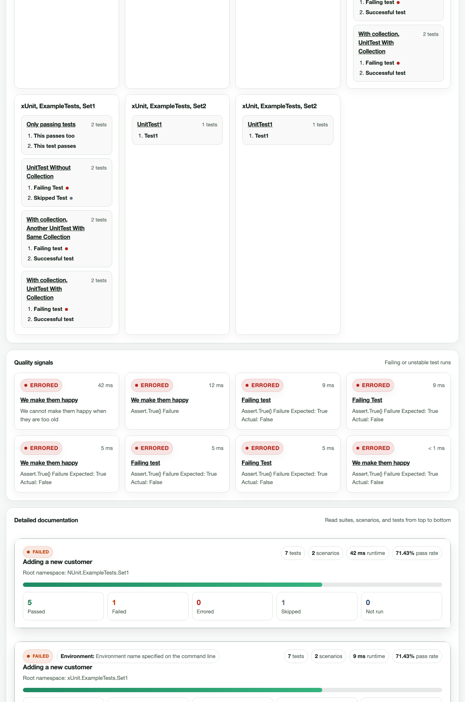

# smink
Smink is a test reporting tool (for now it converts xUnit test logs to pretty HTML)

## Running (for testing)

1. Clone the repository
1. In the root folder, run:

```bash
$ dotnet test ExampleTestProjects/xUnit.ExampleTests/xUnit.ExampleTests.sln --logger:"xunit;LogFilePath=/tmp/logs/{assembly}.testresults.xml"
$ dotnet run --project smink -- /tmp/logs/*.xml /tmp/logs/testreport.html
$ open /tmp/logs/testreport.html
```

And, view the beautiful HTML report, showing all run tests.



## Releasing smink

When you are ready to release, use one of these two approaches.

### Option 1: Manual release

1. Make sure your working tree is clean.
1. Switch to `main` and pull latest changes.
1. Run unit tests.
1. Create and push a tag.
1. Create a GitHub release from the tag.

```bash
git checkout main
git pull origin main
dotnet test smink.UnitTests --verbosity minimal

# Example version:
git tag -a v1.2.0 -m "smink v1.2.0"
git push origin v1.2.0

# Create release with generated notes
gh release create v1.2.0 --title "smink v1.2.0" --generate-notes
```

### Option 2: PowerShell automation script

Use `scripts/Create-Release.ps1` to run the full flow:

- checks tools (`git`, `dotnet`, `gh`)
- checks clean git working tree
- checks out `main`
- pulls latest changes
- runs unit tests
- creates and pushes a tag
- creates a GitHub release (with generated notes)

#### Example

```powershell
pwsh ./scripts/Create-Release.ps1 -Version 1.2.0
```

This creates tag `v1.2.0` and release title `smink v1.2.0`.

#### Useful options

```powershell
# Skip pull and tests (not recommended unless you know why)
pwsh ./scripts/Create-Release.ps1 -Version 1.2.0 -SkipPull -SkipTests

# Create as draft/prerelease
pwsh ./scripts/Create-Release.ps1 -Version 1.2.0 -Draft
pwsh ./scripts/Create-Release.ps1 -Version 1.2.0 -Prerelease

# Disable generated notes
pwsh ./scripts/Create-Release.ps1 -Version 1.2.0 -NoGenerateNotes
```


